# Memory Scramble - Lab Report

**Course:** Concurrent Programming Lab  
**Date:** November 11, 2025  
**Project:** Memory Scramble - A Concurrent Memory Matching Game

---

## Table of Contents

1. [Introduction](#introduction)
2. [Project Overview](#project-overview)
3. [Source Code Structure](#source-code-structure)
4. [Implementation Details](#implementation-details)
5. [Containerization](#containerization)
6. [Running the Application](#running-the-application)
7. [Game Rules and Functionality](#game-rules-and-functionality)
8. [API Endpoints](#api-endpoints)
9. [Testing](#testing)
10. [Conclusion](#conclusion)

---

## Introduction

This lab implements a concurrent, multiplayer memory matching game inspired by MIT 6.102 Problem Set 4. The game is built using Java 21 and Spring Boot, featuring thread-safe card operations, player synchronization, and real-time game state updates. Multiple players can interact with the same game board simultaneously, requiring careful synchronization to maintain consistency and prevent race conditions.

The implementation demonstrates advanced concurrent programming concepts including:

- Thread synchronization using Java's `synchronized` keyword and wait/notify mechanisms
- Deadlock prevention through ordered lock acquisition
- Thread-safe state transitions in mutable objects
- RESTful API design for concurrent client interactions

---

## Project Overview

**Memory Scramble** is a web-based multiplayer memory matching game where:

- Multiple players simultaneously attempt to match pairs of cards
- Cards can be flipped, matched, and removed from the board
- Players can watch for real-time board changes
- Players can replace card values across the entire board
- The game automatically resets every 5 minutes to allow fresh starts

**Key Technologies:**

- **Language:** Java 21
- **Framework:** Spring Boot 3.5.7
- **Build Tool:** Maven 3.9.11
- **Containerization:** Docker with multi-stage builds
- **Web Interface:** HTML/CSS/JavaScript (vanilla)

---

## Source Code Structure

The project follows a standard Maven directory structure with clear separation of concerns:

```
src/
├── main/
│   ├── java/com/pr/memory_scramble/
│   │   ├── MemoryScrambleApplication.java      # Main application entry point
│   │   ├── controller/
│   │   │   ├── AliveController.java            # Health check endpoint
│   │   │   └── GameController.java             # Game API endpoints
│   │   ├── exception/
│   │   │   ├── CardRemovedException.java       # Exception for removed cards
│   │   │   ├── InvalidCardAddressException.java # Exception for invalid coordinates
│   │   │   ├── RestrictedCardAccessException.java # Exception for access violations
│   │   │   └── handler/
│   │   │       └── GlobalExceptionHandler.java # Centralized error handling
│   │   ├── model/
│   │   │   ├── Board.java                      # Game board with thread-safe operations
│   │   │   ├── Card.java                       # Individual card with state management
│   │   │   └── CardState.java                  # Card state enumeration
│   │   ├── scheduler/
│   │   │   ├── AliveScheduler.java             # Periodic alive logging
│   │   │   └── ResetScheduler.java             # Periodic board reset
│   │   └── service/
│   │       ├── CommandService.java             # Game logic coordination
│   │       └── SimulationService.java          # Simulation mode support
│   └── resources/
│       ├── application.properties               # Main configuration
│       ├── application-simulation.properties    # Simulation profile config
│       ├── board.txt                            # Default board layout (5x5)
│       ├── simulation/
│       │   └── board.txt                        # Simulation board layout
│       └── static/
│           └── index.html                       # Web interface
└── test/
    ├── java/com/pr/memory_scramble/
    │   ├── MemoryScrambleApplicationTests.java  # Application context tests
    │   └── model/
    │       └── BoardTest.java                   # Board unit tests
    └── resources/
        ├── application.properties               # Test configuration
        └── board.txt                            # Test board layout
```

### Key Components

#### 1. **Model Layer** (`model/`)

**`Card.java`** - Represents an individual card with thread-safe state transitions:

- **States:** `DOWN` (face down), `UP` (face up), `CONTROLLED` (owned by a player), `NONE` (removed)
- **Thread Safety:** All methods are synchronized to prevent race conditions
- **Wait/Notify:** Uses Java's built-in concurrency mechanisms for player coordination
- **Rep Invariant:** Ensures state consistency (e.g., controlled cards must have an owner)

**`Board.java`** - Manages the game board and coordinates player interactions:

- **Grid Structure:** Rectangular grid of cards loaded from configuration file
- **Concurrency Control:** Prevents deadlocks through ordered lock acquisition
- **Player Isolation:** Each player sees only their controlled cards and face-up cards
- **Atomic Operations:** Flip, match, and map operations maintain board consistency

**`CardState.java`** - Enumeration defining card states: `DOWN`, `UP`, `CONTROLLED`, `NONE`

#### 2. **Controller Layer** (`controller/`)

**`GameController.java`** - Exposes RESTful endpoints for game interactions:

- `GET /look/{playerId}` - View current board state
- `GET /flip/{playerId}/{row},{column}` - Flip a card at position
- `GET /replace/{playerId}/{fromCard}/{toCard}` - Replace all cards with matching value
- `GET /watch/{playerId}` - Wait for board changes (blocking operation)

**`AliveController.java`** - Health check endpoint for monitoring

#### 3. **Service Layer** (`service/`)

**`CommandService.java`** - Coordinates game logic between controllers and models:

- Validates coordinates before flipping
- Delegates operations to the Board
- Returns formatted board representations

**`SimulationService.java`** - Provides automated simulation mode for testing

#### 4. **Exception Handling** (`exception/`)

Custom exceptions for specific game scenarios:

- `CardRemovedException` - Attempting to flip a matched/removed card
- `InvalidCardAddressException` - Invalid row/column coordinates
- `RestrictedCardAccessException` - Accessing a card controlled by another player

**`GlobalExceptionHandler.java`** - Centralized exception handling returning appropriate HTTP responses

#### 5. **Schedulers** (`scheduler/`)

**`ResetScheduler.java`** - Automatically resets the board every 5 minutes (disabled in simulation mode)

**`AliveScheduler.java`** - Logs periodic "alive" messages for monitoring

---

## Implementation Details

### Thread Safety and Concurrency

The implementation uses several concurrency patterns to ensure thread safety:

#### 1. **Synchronized Methods**

All Card state-changing methods are synchronized to prevent concurrent modification:

```java
public synchronized void flipUpAsFirst(String playerId) throws InterruptedException {
    if (isControlledByPlayer(playerId)) return;
    while (state == CardState.CONTROLLED) {
        wait();  // Wait if another player controls this card
    }
    state = CardState.CONTROLLED;
    this.controlledBy = playerId;
}
```

#### 2. **Ordered Lock Acquisition**

The Board's `map()` operation acquires locks in a consistent order to prevent deadlocks:

```java
List<Card> sortedCards = cards.stream()
    .sorted(Comparator.comparingInt(System::identityHashCode))
    .toList();

for (Card card : sortedCards) {
    synchronized (card) {
        card.setValue(mapper.apply(card.getValue()));
    }
}
```

#### 3. **Wait/Notify Pattern**

Cards use Java's wait/notify for player coordination:

- Players wait when attempting to flip cards controlled by others
- Cards notify waiting threads when released

#### 4. **Board-Level Synchronization**

The Board uses synchronized blocks for operations affecting multiple cards:

- Flipping down unmatched cards
- Removing matched pairs
- Watching for changes

### Data Structures and Algorithms

- **Card Storage:** `ArrayList<Card>` with row-major ordering
- **Coordinate Conversion:** `index = row × columns + column`
- **Player Views:** Dynamic filtering based on card state and ownership
- **Change Notification:** Observer pattern using Runnable listeners

### Configuration

The board layout is loaded from `board.txt`:

```
5x5
A B C D E
A B C D F
E F G H I
G H I J J
K L K L M
```

First line specifies dimensions (`rows×columns`), followed by card values.

---

## Containerization

The application uses Docker for easy deployment and consistent runtime environments.

### Dockerfile

The project uses a **multi-stage build** to optimize the final image size:

```dockerfile
# Stage 1: Build the application using Maven
FROM maven:3.9.11-eclipse-temurin-21-alpine AS build
WORKDIR /app

COPY pom.xml .
COPY src ./src

RUN mvn clean package -DskipTests

# Stage 2: Create the runtime image
FROM eclipse-temurin:21-jdk-alpine
WORKDIR /app

COPY --from=build /app/target/memory_scramble-0.0.1-SNAPSHOT.jar app.jar

EXPOSE 8080

ENTRYPOINT ["java", "-jar", "app.jar"]
```

### Docker Compose Configuration

The `docker-compose.yaml` orchestrates the application:

```yaml
services:
  memory-scramble-app:
    image: memory-scramble:latest
    build:
      context: .
      dockerfile: Dockerfile
    ports:
      - "8080:8080"
    environment:
      - SPRING_PROFILES_ACTIVE=${SPRING_PROFILES_ACTIVE:-}
    restart: unless-stopped
```

---

## Running the Application

### Prerequisites

- Docker Desktop installed
- Docker Compose installed (usually bundled with Docker Desktop)
- Git (to clone the repository)

### Starting the Container

#### Option 1: Using Docker Compose

1. **Navigate to the project directory:**

   ```bash
   cd /Users/mcittkmims/Documents/prlabs/memory_scramble
   ```

2. **Build and start the container:**

   ```bash
   docker-compose up --build
   ```

3. **Access the application:**

   - Open your browser to: `http://localhost:8080`
   - The web interface will load automatically

4. **Stop the container:**
   ```bash
   docker-compose down
   ```

#### Option 2: Using Docker Commands Directly

1. **Build the Docker image:**

   ```bash
   docker build -t memory-scramble:latest .
   ```

2. **Run the container:**

   ```bash
   docker run -p 8080:8080 memory-scramble:latest
   ```

3. **Run with simulation mode:**
   ```bash
   docker run -p 8080:8080 -e SPRING_PROFILES_ACTIVE=simulation memory-scramble:latest
   ```

## Game Rules and Functionality

The Memory Scramble game implements the following rules, as demonstrated in the frontend screenshots:

### Rule 1: Basic Card Flipping

#### Rule 1a: Viewing the Board

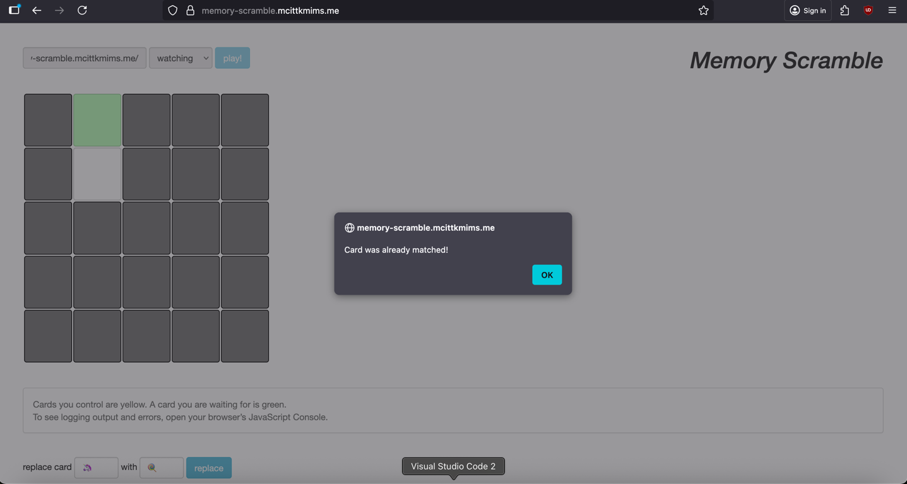

- Players can view the current state of the board
- Face-down cards are shown as gray squares
- Players' controlled cards are highlighted in yellow

#### Rule 1b: First Card Flip

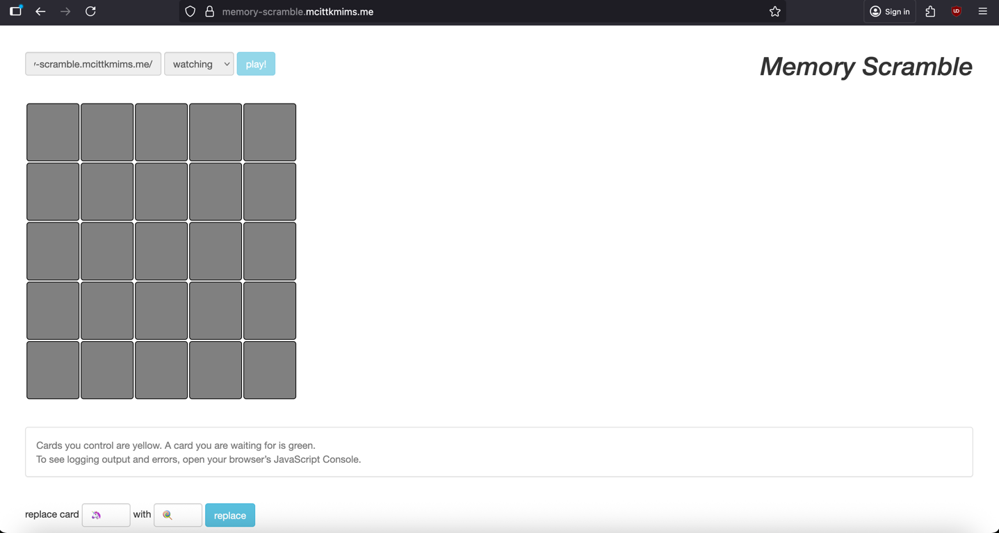


- When a player flips their first card, it stays face-up and is marked as controlled (yellow)
- The card value becomes visible to the player
- Other players cannot see this card yet

#### Rule 1c: Second Card Flip - Match

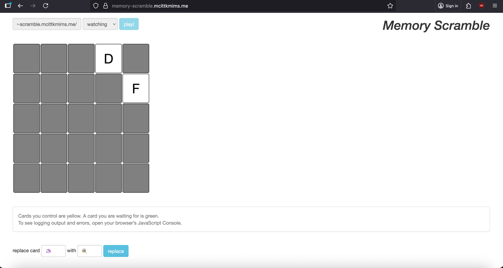
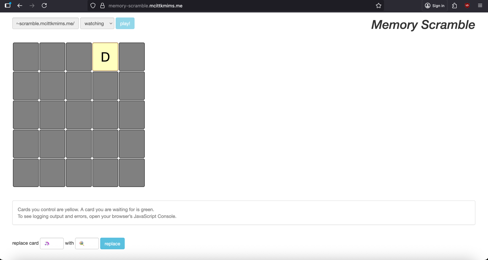

- If the second card matches the first card, both cards are removed from the board
- The matched pair disappears, leaving empty spaces
- The player can continue flipping

#### Rule 1d: Second Card Flip - No Match

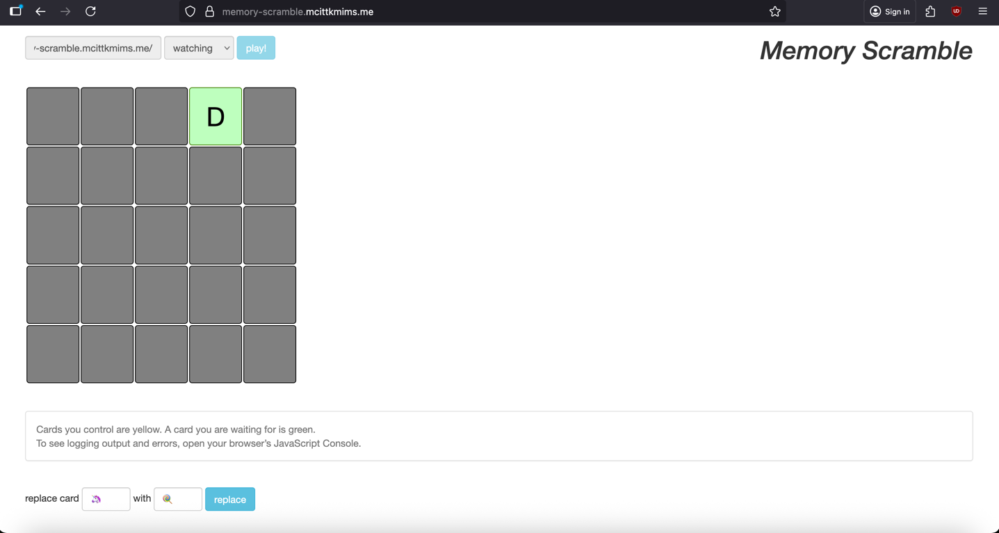

- If the second card doesn't match, both cards flip back face-down
- Neither card is removed
- The player can try again with different cards

### Rule 2: Concurrent Player Interactions

#### Rule 2a: Other Players' Cards

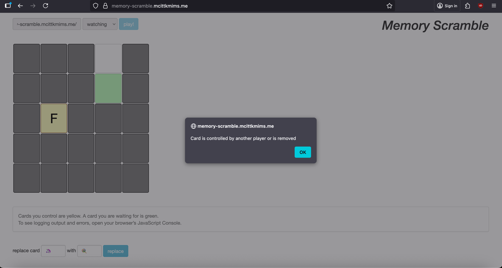
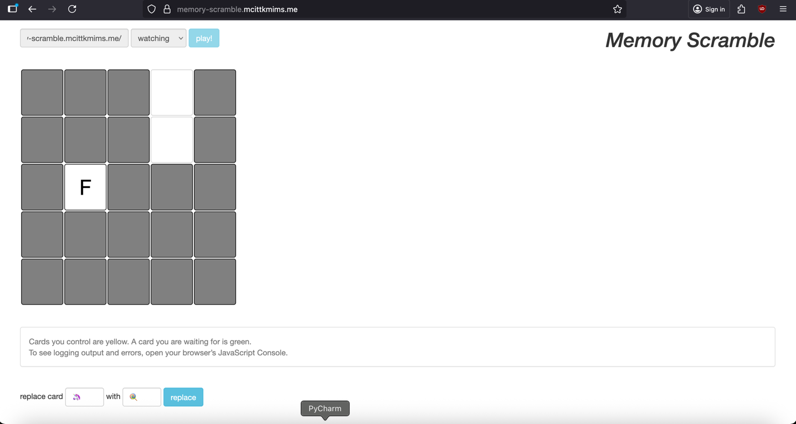

- When one player controls a card, other players can see it (but it remains yellow for the owner)
- Other players cannot flip cards that are controlled by someone else
- Attempting to flip a controlled card causes the player to wait

#### Rule 2b: Waiting for Cards

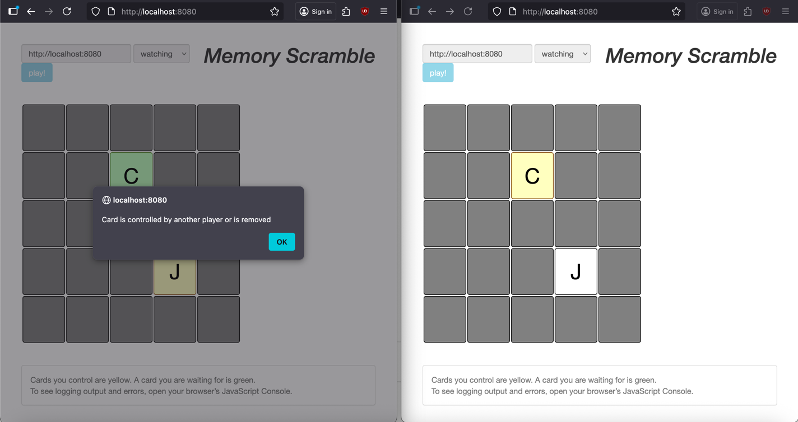
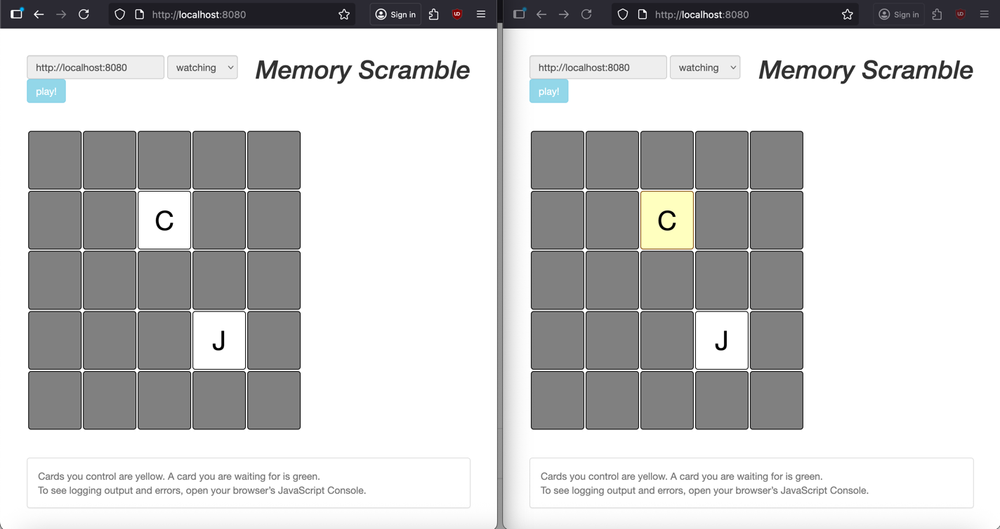

- When a player tries to flip a card controlled by another player, the card shows as green (waiting)
- The request blocks until the card is released
- Once released, the waiting player can acquire the card

#### Rule 2d: Card Removal Synchronization

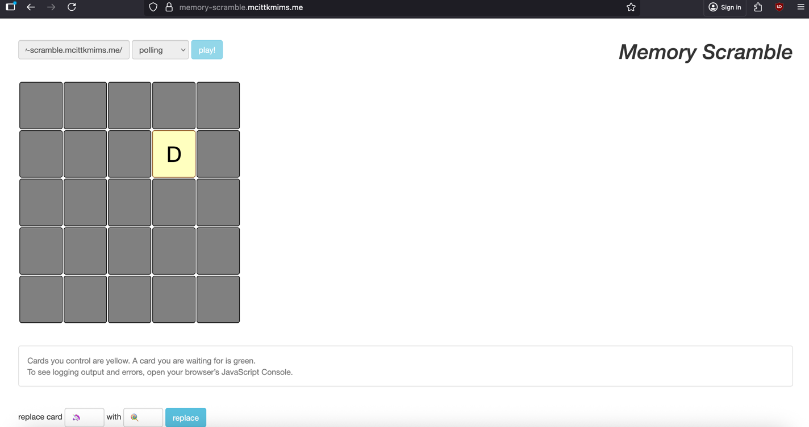
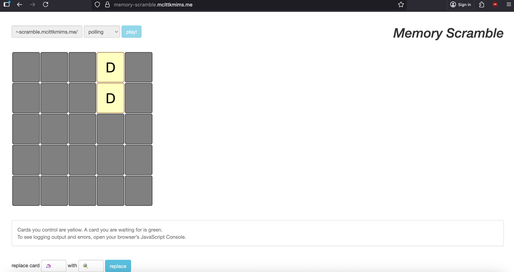

- When a player matches and removes cards, all other players see the updated board
- Removed cards appear as empty spaces to all players
- Prevents race conditions when multiple players target the same cards

#### Rule 2e: Automatic Flip-Down

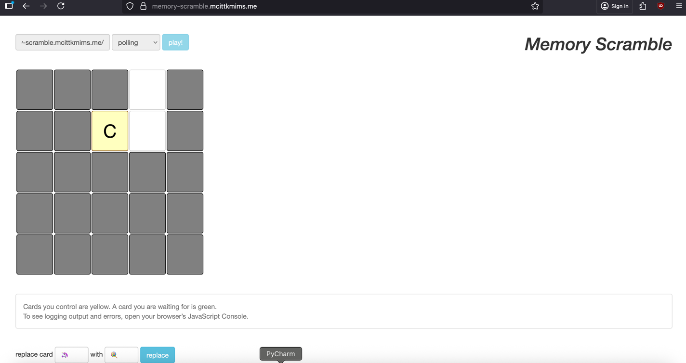
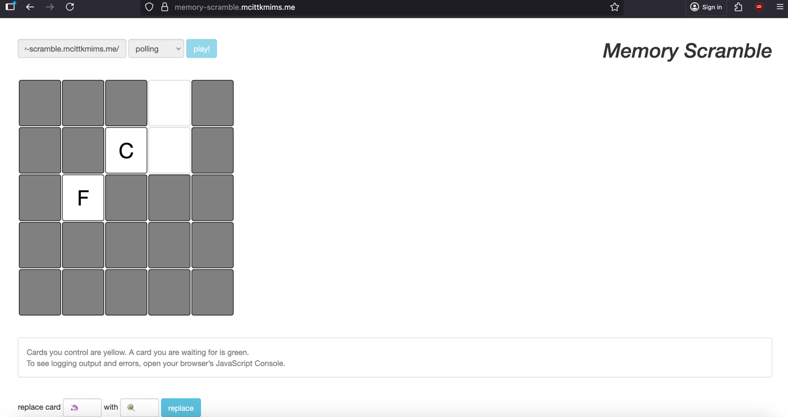

- When a player starts a new matching attempt, their previous unmatched cards automatically flip face-down
- This happens before the new card is flipped
- Ensures each player can only control up to 2 cards at a time

### Rule 3: Advanced Operations

#### Rule 3a: Card Replacement (Map Operation)

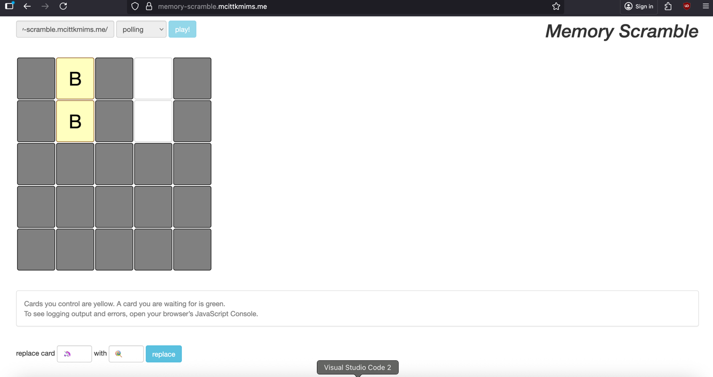
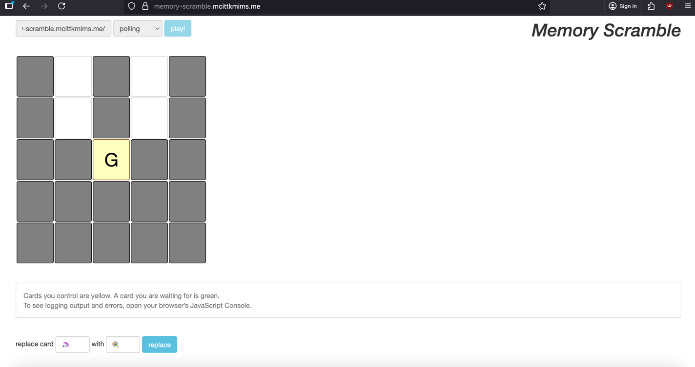

- Players can replace all cards with a specific value with a different value
- The operation is atomic and thread-safe
- All instances of the source card are changed simultaneously
- The operation prevents deadlocks through ordered lock acquisition

#### Rule 3b: Watch for Changes

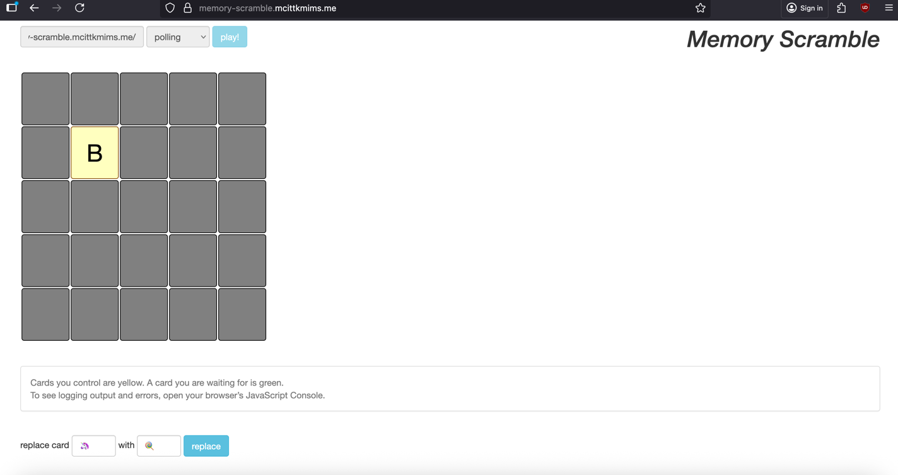
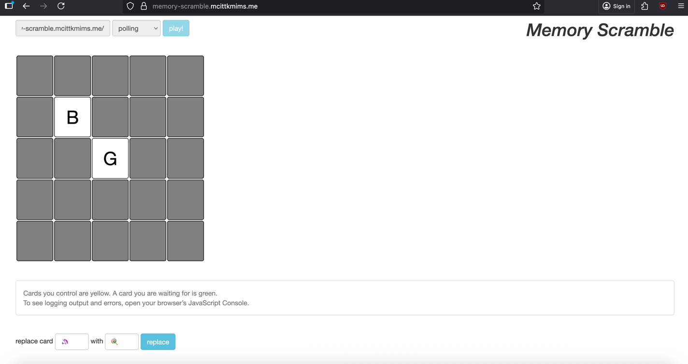

- Players can watch for any change on the board
- The watch operation blocks until someone modifies the board
- Once a change occurs, the updated board state is returned
- Useful for implementing real-time updates in the UI

### Concurrency Guarantees

The implementation ensures:

1. **Atomicity:** Operations like flip, match, and map are atomic
2. **Consistency:** Board state remains valid through all transitions
3. **Isolation:** Players see consistent views of the board
4. **Durability:** No durability required (game state is ephemeral)
5. **Deadlock Prevention:** Ordered lock acquisition prevents circular waits
6. **Fairness:** Wait/notify ensures fair access to contested cards

---

## API Endpoints

The game exposes the following RESTful API:

### 1. Health Check

```
GET /alive
```

**Response:** `"Alive"` (200 OK)

### 2. View Board

```
GET /look/{playerId}
```

**Parameters:**

- `playerId` (path) - Unique identifier for the player

**Response:** String representation of the board from the player's perspective

### 3. Flip Card

```
GET /flip/{playerId}/{row},{column}
```

**Parameters:**

- `playerId` (path) - Unique identifier for the player
- `row` (path) - Row index (0-based)
- `column` (path) - Column index (0-based)

**Response:** Updated board state after flip

### 4. Replace Cards

```
GET /replace/{playerId}/{fromCard}/{toCard}
```

**Parameters:**

- `playerId` (path) - Unique identifier for the player
- `fromCard` (path) - Original card value to replace
- `toCard` (path) - New card value

**Response:** Updated board state after replacement

### 5. Watch for Changes

```
GET /watch/{playerId}
```

**Parameters:**

- `playerId` (path) - Unique identifier for the player

**Response:** Board state after any change occurs (blocking operation)


### Error Responses

- **400 Bad Request:** Invalid card address or coordinates out of bounds
- **403 Forbidden:** Attempting to access a card controlled by another player
- **410 Gone:** Attempting to flip a card that has been removed
- **500 Internal Server Error:** Unexpected server error

---

## Testing

### Unit Tests

The project includes comprehensive unit tests for the Board model:

**File:** `src/test/java/com/pr/memory_scramble/model/BoardTest.java`

Tests cover:

- Board initialization from configuration file
- Card flipping logic
- Match detection and removal
- Player isolation and visibility
- Thread safety and concurrency
- Map operations
- Watch functionality

### Running Tests

#### Using Maven:

```bash
mvn test
```

#### Using Maven Wrapper:

```bash
./mvnw test
```

#### Inside Docker:

```bash
docker run --rm memory-scramble:latest mvn test
```

### Test Coverage Areas

1. **Basic Operations:**

   - Flipping cards
   - Matching pairs
   - Viewing board state

2. **Concurrency:**

   - Multiple players flipping simultaneously
   - Card access synchronization
   - Deadlock prevention

3. **Edge Cases:**

   - Invalid coordinates
   - Removed cards
   - Empty boards

4. **Map Operations:**
   - Replacing all instances of a card value
   - Atomic transformations

---


## References

- MIT 6.102 Problem Set 4: Memory Scramble - https://web.mit.edu/6.102/www/sp25/psets/ps4/
- Spring Boot Documentation - https://docs.spring.io/spring-boot/docs/current/reference/html/
- Java Concurrency in Practice - Brian Goetz
- Docker Documentation - https://docs.docker.com/